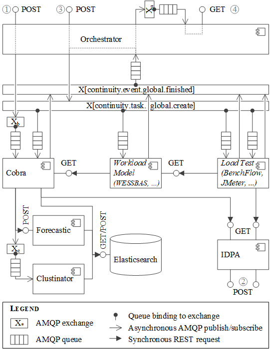

#  ContinuITy
[](https://doi.org/10.5281/zenodo.3966805)
[](https://travis-ci.org/ContinuITy-Project/ContinuITy)

ContinuITy is a research project on “Automated Performance Testing in Continuous Software Engineering”, launched by [NovaTec Consulting GmbH](https://www.novatec-gmbh.de/) and the [University of Stuttgart](https://www.uni-stuttgart.de/) ([Reliable Software Systems Group](https://www.iste.uni-stuttgart.de/rss/)). ContinuITy started in September 2017 with a duration of 2.5 years. It is funded by the [German Federal Ministry of Education and Research (BMBF)](https://www.bmbf.de/). For details about the research project, please refer to our [Web site](https://continuity-project.github.io/).

## Architecture Overview

The architectural pattern is an orchestrator that receives orders at `POST /order/submit` and orchestrates the other services to generate the required output. The other services are called via [RabbitMQ](https://www.rabbitmq.com/) exchanges or REST over HTTP. For communication via REST, we use [Eureka](https://github.com/Netflix/eureka). The created artifacts are shared between the services by providing a link that can be called to retrieve the artifact. The following provides an overview of the application.



#### RabbitMQ Exchanges:

Label | Exchange Name | Type | Purpose
--- | --- | --- | ---
 / | continuity.task.global.create | event | Submit a task to a service
 / | continuity.event.global.finished | event | A task has finished
 / | continuity.event.global.failed | event | A task has failed (bound to the dead letter queues of the services)
X<sub>a</sub> | continuity.event.orchestrator.finished | event | An order has been processed
X<sub>b</sub> | continuity.task.cobra.process_traces | task | Process new monitoring data (i.e., traces or requests)
X<sub>c</sub> | continuity.task.clustinator.cluster | task | Cluster newly available sessions

### Load Test Generation Overview

Essentially, the load test generation process is a series of (sometimes complex) transformations. Several services are involved for extracting a load test (or even the load test results) from measurement data. The artifacts that can occur in the transformation process are the following:

* `traces`: The monitored distributed traces in the [OPEN.xtrace](https://github.com/spec-rgdevops/OPEN.xtrace) format.
* `sessions`: User sessions, which group requests by session ID. See [Session.java](continuity.lib.api/src/main/java/org/continuity/api/entities/artifact/session/Session.java) for details.
* `behavior-model`: A model describing the behavior of one or multiple user groups. Can be either a `markov-chain` or `request-rates`. See [MarkovBehaviorModel.java](continuity.lib.api/src/main/java/org/continuity/api/entities/artifact/markovbehavior/MarkovBehaviorModel.java) and [RequestRatesModel.java](continuity.service.request.rates/src/main/java/org/continuity/request/rates/model/RequestRatesModel.java) for details.
* `intensity`: The workload intensity, i.e., number of concurrent users.
* `workload-model`: Essentially, a more detailed version of the behavior model. Can be `wessbas`, which we use for `markov-chain` behavior models, or again a simple `request-rates` model. Please see [here](https://github.com/Wessbas) for details on WESSBAS models.
* `load-test`: An (executable) load test script. We currently support `jmeter` ([JMeter](https://jmeter.apache.org/)) and `benchflow` ([BenchFlow](https://github.com/benchflow/benchflow)), but further types may be added.
* `test-result`: The results of a load test execution. Currently only available for JMeter.

For participating in the load test generation process, each service needs to register at the central Eureka service with the artifacts it needs as input and the ones it can produce. Based on this infromation, the Orchestrator decides which services to invoke in which order.

### Services for Load Test Generation

The following services are currently available.

* [Cobra](continuity.service.cobra): Prepares the initial data required for the load test generation.
  * Produces:
    * `traces`
    * `sessions`
    * `behavior-model`
    * `intensity` (always, regardless of the requested artifact)
  * Requires: A description of the workload, which the user needs to provide.
* [WESSBAS](continuity.service.wessbas): Creates [WESSBAS models](https://github.com/Wessbas).
  * Produces:
    * `behavior-model` (type `markov-chain`)
    * `workload-model` (type `wessbas`)
  * Requires:
    * `sessions` (for `behavior-model`)
    * `behavior-model` (type `markov-chain`; for `workload-model`)
* [RequestRates](continuity.service.request.rates): Creates request rates models.
  * Produces: `workload-model` (type `request-rates`)
  * Requires: `traces`
* [JMeter](continuity.service.jmeter): Generates and executes [JMeter](https://jmeter.apache.org/) load tests.
  * Produces:
    * `load-test` (type `jmeter`)
    * `test-result`
  * Requires:
    * `workload-model` (any type; for `load-test`)
    * `load-test` (type `jmeter`; for `test-result`)
* [BenchFlow](continuity.service.benchflow): Generates [BenchFlow](https://github.com/benchflow/benchflow) load tests.
  * Produces: `load-test` (type `benchflow`)
  * Requires: `workload-model` (type `wessbas`)

### Further Services

There are a few more services that indirectly involved in the transformation process:

* [IDPA](continuity.service.idpa): Manages instances of the Input Data and Properties Annotation (IDPA), which is a parameterization model. It allows to fully automate the transformation process.
* [Forecastic](https://github.com/ContinuITy-Project/forecastic) (external repository): Helper service for Cobra, which is used for intensity forecasting.
* [Clustinator](https://github.com/ContinuITy-Project/clustinator) (external repository): Helper service for Cobra, which is used for incremental session clustering and learning of the workload model from monitored data.

### Command-line Interface

Finally, we provide a [CLI](continuity.cli/README.md) for easing the interaction with the Orchestrator.

### Orders

For generating load tests, one needs to submit an `order` to the Orchestrator via `POST /order/submit` ((3) in the figure). It is best to use the CLI, which has a command `order create`. This command will create a template to be filled. Below is an example. The `target` defines the artifact to be generated. The `workload` is an instance of the Load Test Context-tailoring Language (LCtL) and describes the workload, from which Cobra should extract the initial artifact, e.g., `behavior-model`. The `options` modify the default options. In this case, we make sure to use the `telescope` forecaster.

It is also possible to add artifacts from previous orders in the `source` field. These will be considered if possible. For instance, if we have generated a JMeter `load-test`, but now want to have a BenchFlow `load-test`, we can use the `workload-model` from the JMeter generation in the source, and the Orchestrator will skip all transformation steps before `workload-model`.

```yaml
---
target: load-test
app-id: my-application
version: v1
workload:
  timeframe:
  - !<timerange>
    from: 2019-09-01T02:00:00
    duration: P140D
  - !<conditional>
    temperature:
      greater: 20
  aggregation: !<percentile>
    p: 95
options:
  forecast:
    approach: telescope
```

### Orchestration Details

Here, we provide some details on the orchestration process.

Based on a submitted order, the orchestrator determines the required steps (e.g., `behavior-model` creation, `workload-model` creation, and `load-test` creation), which it summarizes in a `recipe`. For each step, it submits a `task` to the `continuity.task.global.create` exchange with the following routing key: `<service-name>.<artifact>`, e.g., `cobra.behavior-model`. The respective service will then generate the requested artifact.

When a service is finished with a task, it publishes an event to `continuity.event.global.finished`. The orchestrator is notified and checks whether the task was successfully processed. If so, it submits the next task to the next service, e.g., to the Wessbas service. In case of an error, the order is aborted and the error reported to the user.

When a service completely fails, e.g., with an exception, the task will be forwarded to the `continuity.event.global.failed` exchange. The Orchestrator listens on that and reacts.

When an order is finished - either successfully processed or aborted - it will be published to he `continuity.orchestrator.event.finished` exchange and can be retrieved via `GET /order/wait`. This endpoint can already be called before to wait for the order for a given time span.

## Configuration Management

The Orchestrator also manages per-service configurations. Users can upload configurations to `POST /config` (or by using the [CLI](continuity.cli)), which the Orchestrator will forward to the respective service via the `continuity.event.orchestrator.configavailable` exchange.

## Scientific Publications

ContinuITy implements or is based on the work of several scientific publications, which we list in the following. Here, we only consider publications that directly influenced the implementation; further publications of the ContinuITy project are available on the [project web site](https://continuity-project.github.io/publications.html).

* Henning Schulz, Tobias Angerstein, and André van Hoorn: *Towards Automating Representative Load Testing in Continuous Software Engineering* ([full paper](https://dl.acm.org/citation.cfm?id=3186288)), Companion of the International Conference on Performance Engineering (ICPE) 2018, Berlin, Germany 
* Henning Schulz, Tobias Angerstein, Dušan Okanović, and André van Hoorn: *Microservice-tailored generation of session-based workload models for representative load testing* ([full paper](https://continuity-project.github.io/files/SchulzAngersteinOkanovicvanHoorn2019MicroserviceTailoredGenerationOfSessionBasedWorkloadModelsForRepresentativeLoadTesting-camera-ready-stamped.pdf)), Proceedings of the 27th IEEE International Symposium on the Modeling, Analysis, and Simulation of Computer and Telecommunication Systems (MASCOTS 2019), 2019
* Henning Schulz, André van Hoorn, and Alexander Wert: *Reducing the maintenance effort for parameterization of representative load tests using annotations* ([full paper](https://onlinelibrary.wiley.com/doi/abs/10.1002/stvr.1712)), Software Testing, Verification & Reliability, 2020
* Christian Vögele, André van Hoorn, Eike Schulz, Wilhelm Hasselbring, and Helmut Krcmar: *WESSBAS: extraction of probabilistic workload specifications for load testing and performance prediction - a model-driven approach for session-based application systems*, Software and Systems Modeling 17(2): 443-477 (2018)
